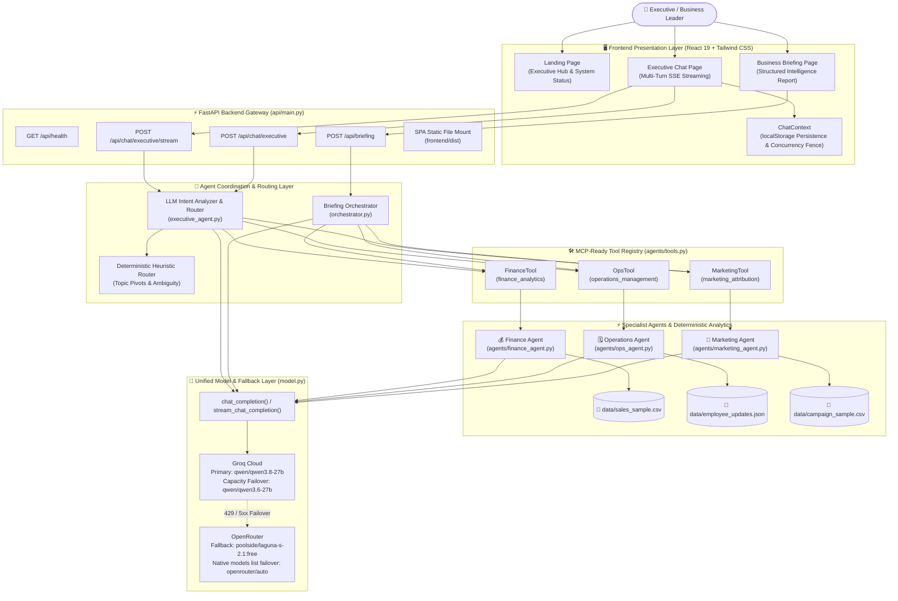

# AGentic Resolve — System Architecture & Design Specification

## 1. Architectural Overview

AGentic Resolve is a conversational AI Chief of Staff and multi-agent enterprise intelligence system. Built with **Python**, **FastAPI**, **Strands Agents SDK**, and **React**, it enables executives and business analysts to inquire into enterprise data through natural language and receive grounded, cross-departmental answers.

### Core Architectural Principles:
1. **Agents-as-Tools Pattern**: Hierarchical multi-agent delegation where an Executive Agent coordinates specialized sub-agents with scoped domain tools and focused system prompts.
2. **Deterministic Analytics Grounding**: LLMs are strictly used for interpretation, routing, and strategic synthesis. All calculations (revenue trends, task staleness, conversion ROI) are computed deterministically from verified company data.
3. **Decoupled Workflows**:
   - **Executive Chat (`/api/chat/executive` & `/api/chat/executive/stream`)**: Dynamic, context-aware conversational thread that consults specialists on demand and never repeats baseline reports.
   - **Full Business Briefing (`/api/briefing`)**: Structured multi-agent audit across Finance, Operations, and Marketing with fault-tolerant status tracking.
4. **Provider-Agnostic Model Layer**: Unified completion layer routing through primary (Groq) and fallback (OpenRouter with native ordered model failover).
5. **Single-Process Deployment**: FastAPI serves the JSON/SSE API endpoints while concurrently serving the production-built React SPA from a single port.

---

## 2. System Architecture Diagram



---

## 3. Component Deep Dive

### 3.1 Executive Agent (`executive_agent.py`)
- **Intent Analysis & Reference Resolution**: Evaluates recent conversation history to resolve pronouns and elliptical questions (e.g. *"Why?"*, *"Which product is responsible?"*, *"What should I do about it?"*).
- **Ambiguity Detection**: Queries with ambiguous domains (e.g., *"Show me performance."*) trigger an immediate clarifying question with **0 specialists consulted**, avoiding token and compute waste.
- **Topic Pivot Handling**: Instructions such as *"Forget that. Which tasks are blocked?"* immediately discard preceding topics and route strictly to the target specialist.
- **Synthesis & Anti-Repetition Rules**: Enforces strict constraints prohibiting verbatim reprinting of previous sales reports on subsequent turns.
- **Streaming Generator (`stream_executive_turn`)**: Emits real-time Server-Sent Events (`status`, `specialist`, `token`, `done`) enabling progressive UI updates and user cancellation.

### 3.2 Full Business Briefing Orchestrator (`orchestrator.py`)
- **Fault-Tolerant Specialist Collection**: Executes Finance, Operations, and Marketing investigations in isolated exception boundaries.
- **Partial Failure Survival**: If any specialist fails or data is missing, the agent notes that department's status as `unavailable`, synthesizes the remaining verified departments, and explicitly alerts leadership without fabricating data.
- **Structured Section Extraction**: Parses synthesis into executive intelligence sections:
  - Executive Summary
  - Critical Risks & Blockers
  - Strategic Opportunities
  - Top 3 Recommended Actions

### 3.3 Specialist Agents & Deterministic Analytics
- **Finance Agent (`agents/finance_agent.py`)**:
  - Computes product revenues, MoM percentage growth, 3-month linear regression forecasts, and statistical anomaly spikes (>1.5 std dev) over `data/sales_sample.csv`.
- **Operations Agent (`agents/ops_agent.py`)**:
  - Scans `data/employee_updates.json` for blocked tasks, stale deadlines (>10 days without update), and high-priority escalation items.
- **Marketing Agent (`agents/marketing_agent.py`)**:
  - Aggregates impressions, clicks, conversions, CTR, and conversion rates by regional geography and age cohorts over `data/campaign_sample.csv`.
- **Structured Output Schema**:
  ```json
  {
    "specialist": "finance",
    "status": "ok",
    "answer": "...",
    "findings": ["..."],
    "metrics": {...},
    "warnings": ["..."],
    "recommendations": ["..."]
  }
  ```

### 3.4 Tool Registry & Boundary (`agents/tools.py`)
- Implements a standardized `AgentTool` protocol:
  - `name`: Unique tool identifier.
  - `description`: LLM-facing capabilities description.
  - `parameters`: JSON Schema describing required inputs.
  - `execute()`: Callable entrypoint returning structured dictionaries.
- Decouples specialist logic to prepare for future **Model Context Protocol (MCP)** tools and **Agent-to-Agent (A2A)** remote services.

### 3.5 Model & Fallback Layer (`model.py`)
- **Unified Interface**: `chat_completion()` and `stream_chat_completion()`.
- **Primary Provider**: Groq Cloud running `qwen/qwen3.8-27b` with automatic capacity failover to `qwen/qwen3.6-27b`.
- **Secondary Provider**: OpenRouter running `poolside/laguna-s-2.1:free` with native `models` array failover (`openrouter/auto`).
- **Sanitization**: Strips `<think>...</think>` tokens completely to guarantee zero internal chain-of-thought leaks to user interfaces.
- **Observability Metadata**: Tracks `provider`, `model`, `latency_ms`, and `fallback_used` without logging API keys or raw tokens.

---

## 4. Data Flow Sequences

### Sequence A: Multi-Turn Conversational Inquiry
```
User: "How are sales performing?"
  ├── Executive Agent classifies: Finance
  ├── Finance Tool queries sales_sample.csv -> AlphaApp: $118.7K (+34%), BetaSuite: $50.9K (+92%)
  └── Synthesis: "Sales are performing strongly across both product lines..." (Badge: Finance Specialist)

User: "Why?"
  ├── Executive Agent resolves context: "Explain why sales performed that way based on data"
  ├── Finance Tool queries MoM growth drivers
  └── Synthesis: Explains MoM consistency without reprinting the baseline report numbers.

User: "Could operations be contributing?"
  ├── Executive Agent classifies: Cross-domain [Finance, Operations]
  ├── Finance Tool provides product trajectory
  ├── Operations Tool checks blocked tasks (Priya Patel roadmap, Tom AWS migration)
  └── Synthesis: Correlates operational blockers as delivery risk factors rather than sales causes.
```

### Sequence B: Fault-Tolerant Business Briefing
```
User runs /api/briefing
  ├── Orchestrator dispatches Finance, Ops, Marketing
  ├── Finance -> status: consulted, metrics: {...}
  ├── Operations -> status: unavailable (e.g. data corrupt or service offline)
  ├── Marketing -> status: consulted, metrics: {...}
  ├── Orchestrator notes: "Operations temporarily unavailable; do not hallucinate"
  ├── Synthesis: Produces executive briefing based on Finance + Marketing with explicit note on Operations
  └── Frontend renders: Finance (Consulted), Ops (Unavailable - Offline), Marketing (Consulted), with Risks & Actions.
```

---

## 5. Security & Production Safeguards

- **Backend-Only Secrets**: `GROQ_API_KEY` and `OPENROUTER_API_KEY` are read exclusively by server-side Python. Never surfaced to Vite or client bundles.
- **Safe Execution Metadata**: Observability returns high-level steps and model names; raw chain-of-thought, reasoning tags, and system prompts are never exposed.
- **Input Validation**: Message length (<2500 chars), query length (<2500 chars), and agent loop bounds (`MAX_AGENT_STEPS = 5`) protect against denial-of-service and runaway inference loops.
- **Concurrency Fencing**: `requestIdRef` on client-side React prevents out-of-order race conditions from overwriting active assistant responses.
