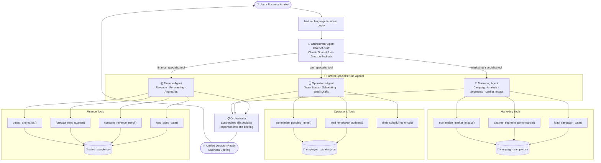

# AGentic Resolve — Multi-Agent Architecture

## Overview

AGentic Resolve uses the **agents-as-tools** pattern from the Strands Agents SDK.
The Orchestrator Agent wraps each specialist sub-agent as a callable tool, enabling
intelligent routing and parallel delegation based on the business query.

## Mermaid Flowchart

## Component Descriptions

| Component | File | Responsibility |
|---|---|---|
| Orchestrator Agent | `orchestrator.py` | Routes queries, synthesizes responses |
| Finance Agent | `agents/finance_agent.py` | Revenue analysis, forecasting, anomaly detection |
| Operations Agent | `agents/ops_agent.py` | Team status, scheduling, email drafts |
| Marketing Agent | `agents/marketing_agent.py` | Campaign analysis, segment ranking, market impact |
| Shared Model | `model.py` | Single BedrockModel config for all agents |

## Data Flow

1. User submits a natural-language business query to `orchestrator.py`
2. Orchestrator Agent (Claude Sonnet 5) determines which specialist(s) are relevant
3. Relevant specialist agents are called (one, two, or all three in parallel)
4. Each specialist uses its tools to load data, compute metrics, and form an answer
5. Orchestrator synthesizes all specialist responses into a single executive briefing
6. Briefing is returned to the user

## Technology

- **Strands Agents SDK** — Agent framework, agents-as-tools multi-agent pattern
- **Amazon Bedrock** — Managed LLM provider
- **Claude Sonnet 5** (`us.anthropic.claude-sonnet-4-5-20251001-v1:0`) — Model
- **Python 3.10+** / **pandas** / **numpy** — Data processing
