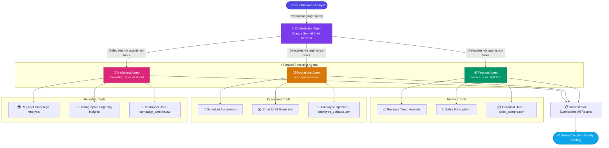

<div align="center">

# 🤖 AGentic Resolve

### *Your AI-Powered Chief of Staff*

[](https://python.org)
[](https://aws.amazon.com/bedrock/)
[](https://github.com/strands-agents/sdk-python)
[](./LICENSE)
[](https://agentsforhumans.devpost.com/)

<br/>

> **Ask one question. Get three expert answers. Instantly.**
>
> AGentic Resolve is a multi-agent professional assistant that orchestrates specialized AI agents in parallel —
> giving you a unified, decision-ready briefing across Finance, Operations, and Marketing in seconds.

</div>

---

## 🎯 What is AGentic Resolve?

AGentic Resolve acts as the **intelligent command center** for your business. Powered by the [Strands Agents SDK](https://github.com/strands-agents/sdk-python) and running on **Amazon Bedrock (Claude Sonnet 5)**, it routes your business query through an orchestrator that dispatches three specialist sub-agents — all working in **parallel** — before synthesizing their insights into one crisp, actionable briefing.

Built for the **[Agents for Humans Hackathon](https://agentsforhumans.devpost.com/)** — Professional Agents track. 🏆

---

## ✨ Key Features

| Feature | Description |
|---|---|
| 🧠 **Orchestrator Agent** | Single entry point — understands your query and delegates intelligently |
| ⚡ **Parallel Execution** | All three specialists run simultaneously — no waiting in line |
| 💰 **Finance Agent** | Revenue trend analysis, forecasting, historical sales insights |
| 🗓️ **Operations Agent** | Scheduling automation, email drafting, employee update summaries |
| 📣 **Marketing Agent** | Ad impact analysis, regional & demographic campaign performance |
| 📋 **Unified Briefing** | All specialist outputs synthesized into one decision-ready response |

---

## 🏗️ Architecture

### System Flowchart



### Flow Summary

```
👤 User Query
    └─▶ 🧠 Orchestrator Agent
            ├─▶ 💰 finance_specialist   ──▶ Sales data + forecasting
            ├─▶ 🗓️ ops_specialist       ──▶ Schedules + email drafts + updates
            └─▶ 📣 marketing_specialist ──▶ Campaign + regional + demographic data
                        │
                        └─▶ 📋 Synthesized Briefing ──▶ ✅ Decision-Ready Output
```

> 📄 For the complete technical diagram, see [ARCHITECTURE.md](./ARCHITECTURE.md).

---

## 🤖 The Specialist Agents

### 💰 Finance Agent — `agents/finance_agent.py`

Crunches your numbers and looks ahead:
- 📈 Revenue trend analysis across product lines
- 🔮 Sales forecasting based on historical patterns
- 📊 Market activity monitoring
- 🗂️ Powered by `data/sales_sample.csv`

### 🗓️ Operations Agent — `agents/ops_agent.py`

Handles the operational backbone of your business:
- 📅 Automated scheduling and calendar management
- ✉️ Professional email drafting
- 📝 Summarizing employee work updates and blockers
- 🗂️ Powered by `data/employee_updates.json`

### 📣 Marketing Agent — `agents/marketing_agent.py`

Decodes what's actually driving growth:
- 🌍 Regional campaign performance breakdown
- 👥 Age group and demographic targeting analysis
- 💡 Ad impact attribution — which campaigns are moving the needle
- 🗂️ Powered by `data/campaign_sample.csv`

---

## 🛠️ Tech Stack

| Technology | Role |
|---|---|
| 🐍 **Python 3.10+** | Core runtime |
| 🤖 **[Strands Agents SDK](https://github.com/strands-agents/sdk-python)** | Multi-agent framework (agents-as-tools pattern) |
| ☁️ **Amazon Bedrock** | Managed model provider |
| 🧠 **Claude Sonnet 5** | LLM powering all agents |

---

## 📦 Project Structure

```
AI_AGENTIC/
├── 🤖 agents/
│   ├── finance_agent.py      # 💰 Revenue trend analysis + forecasting
│   ├── ops_agent.py          # 🗓️ Scheduling, email drafts, employee updates
│   └── marketing_agent.py    # 📣 Ad impact + market research
│
├── 📊 data/
│   ├── sales_sample.csv          # 💰 Synthetic sales & revenue data
│   ├── employee_updates.json     # 🗓️ Synthetic employee work updates
│   └── campaign_sample.csv       # 📣 Synthetic advertising campaign data
│
├── 🧠 orchestrator.py        # Top-level agent, agents-as-tools pattern
├── ⚙️  model.py               # Shared Amazon Bedrock model configuration
├── 📋 requirements.txt       # Python dependencies
├── 🏗️  ARCHITECTURE.md        # Full architecture diagram
├── 📖 README.md
└── 📄 LICENSE                # MIT
```

---

## 🚀 Getting Started

### 1️⃣ Clone & Set Up Environment

```bash
# Clone the repository
git clone <your-repo-url>
cd AI_AGENTIC

# Create and activate a virtual environment
python -m venv .venv

# Linux / macOS
source .venv/bin/activate

# Windows
.venv\Scripts\activate
```

### 2️⃣ Install Dependencies

```bash
pip install -r requirements.txt
```

### 3️⃣ Configure AWS Credentials

Make sure your AWS credentials have **Amazon Bedrock** access enabled for **Claude Sonnet 5**.

```bash
# Option A: AWS CLI
aws configure

# Option B: Environment variables
export AWS_ACCESS_KEY_ID=your_key
export AWS_SECRET_ACCESS_KEY=your_secret
export AWS_DEFAULT_REGION=us-west-2
```

> ⚠️ **Note:** The default region is `us-west-2`. If your Bedrock access is in a different region,
> update the region and model ID in `model.py`.

### 4️⃣ Run the Orchestrator

```bash
python orchestrator.py
```

This fires a sample business query through the orchestrator and prints the **combined expert briefing** from all three specialist agents. 🎉

---

## 📊 Sample Data

All datasets in `/data` are **fully synthetic** — generated specifically to demonstrate the agents' reasoning and delegation logic end-to-end with realistic patterns. No real business data is included.

| File | Agent | Contents |
|---|---|---|
| `sales_sample.csv` | 💰 Finance | Historical revenue, product performance, time-series trends |
| `employee_updates.json` | 🗓️ Operations | Team updates, blockers, task statuses |
| `campaign_sample.csv` | 📣 Marketing | Ad spend, impressions, conversions by region & demographic |

---

## 🏆 Hackathon

AGentic Resolve was built for the **[Agents for Humans Hackathon](https://agentsforhumans.devpost.com/)** — **Professional Agents** track.

The core design challenge: *How do you make a single AI agent feel like an entire expert team?*
The answer: **orchestrate multiple specialist agents and synthesize their outputs intelligently.**

---

## 🔭 What's Next

The roadmap for AGentic Resolve beyond the hackathon:

- 🔗 **Real API integrations** — accounting/sales APIs (QuickBooks, Salesforce), calendar/email (Google Workspace, Microsoft 365), and ad-platform APIs (Google Ads, Meta)
- ☁️ **Amazon Bedrock AgentCore** deployment for production-scale orchestration
- 📊 **Visual Dashboard** — a real-time UI for the orchestrator's briefings
- 🔔 **Proactive Alerts** — agents that surface critical insights without being asked
- 🔐 **Role-based access** — different briefing depths for different stakeholders

---

## 📄 License

MIT — see [LICENSE](./LICENSE) for full details.

---

<div align="center">

Built with ❤️ and ☕ using the [Strands Agents SDK](https://github.com/strands-agents/sdk-python) and Amazon Bedrock.

*"One question. Three experts. One answer."*

</div>
